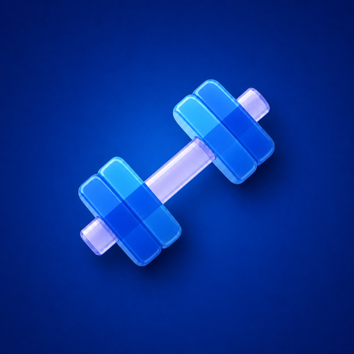

<p align="center">
  
</p>

<h1 align="center">GymApp</h1>

<p align="center">
  <strong>Plan intelligently. Train consistently. Understand your progress.</strong><br>
  A cross-platform workout tracker for Android, iOS, and Garmin.
</p>

<p align="center">
  <a href="https://github.com/Eduard047/GymApp/actions/workflows/security.yml">
    
  </a>
  <a href="https://github.com/Eduard047/GymApp/releases/latest">
    
  </a>
  <a href="LICENSE">
    
  </a>
</p>

<p align="center">
  <a href="https://gymapptracker.com/"><strong>Website &amp; Downloads</strong></a>
  &nbsp;·&nbsp;
  <a href="https://github.com/Eduard047/GymApp/releases/latest"><strong>Download</strong></a>
  &nbsp;·&nbsp;
  <a href="https://gymapptracker.com/support.html"><strong>Support</strong></a>
  &nbsp;·&nbsp;
  <a href="https://gymapptracker.com/privacy-policy.html"><strong>Privacy</strong></a>
</p>

## One training history, wherever you work out

GymApp brings workout planning, live set tracking, progress analysis, and wearable
sync into one coherent experience. Core training works offline; cloud sync is
optional.

| Train | Understand | Stay consistent |
| --- | --- | --- |
| Log exercises, sets, weight, reps, notes, and rest time | Review PRs, volume, intensity, muscle load, and workout comparisons | Use templates, favorites, achievements, and daily, weekly, or monthly missions |
| Generate history-aware workouts with Smart Coach | Explore progress charts, activity heatmaps, and muscle maps | Continue across Android, iPhone, and compatible Garmin devices |

## Platform coverage

| Platform | Technology | Availability |
| --- | --- | --- |
| Android | Kotlin, Jetpack Compose, Room | Production APK and Google Play AAB |
| iOS | SwiftUI, iOS 17+ | Source and universal Simulator build; App Store IPA is not published yet |
| Browser | Full offline-capable workout application, shared-workout handoff, privacy, and support | Live at [gymapptracker.com](https://gymapptracker.com/) |
| Garmin | Connect IQ 3.2+ | Signed Connect IQ Store upload package |
| Cloud | Supabase | Optional account sync and Garmin plan queue |

The mobile interface and public website are available in English, Ukrainian,
and Russian. Android and iOS support light and dark appearance.

## Highlights

- History-aware Smart Coach and Smart Plan recommendations.
- Fast workout logging, reusable templates, and favorite exercises.
- Post-workout analytics with comparable-session and Garmin data.
- Exercise discovery, frequency sorting, and muscle-group mapping.
- Profile, backups, redacted diagnostics, missions, ranks, and achievements.
- Offline-first local accounts with optional authenticated cloud sync.

## Repository guide

| Path | Purpose |
| --- | --- |
| [`app/`](app/) | Android phone application |
| [`ios/GymApp-iOS/`](ios/GymApp-iOS/) | Native iOS application |
| [`garmin/`](garmin/) | Garmin Connect IQ application |
| [`pwa/`](pwa/) | Full browser application, service worker, native callback, legal pages, and workout-handoff routes |
| [`supabase/`](supabase/) | Ordered migrations, templates, and Edge Functions |
| [`tests/`](tests/) | Cross-platform contract and security tests |

Developer setup and operational details live outside the landing page:

- [Development guide](docs/DEVELOPMENT.md)
- [Deployment and release boundaries](docs/OPERATIONS.md)
- [Garmin build guide](garmin/README.md)
- [iOS build and App Store checklist](ios/GymApp-iOS/README.md)

## Quick start

Run the public browser site locally:

```sh
python3 -m http.server 4173 --directory pwa
```

Then open <http://127.0.0.1:4173>. The public root runs the complete browser
application; workout data can remain local, while account sync is optional.

Run the cross-platform contract suite:

```sh
node --test tests/*.test.mjs
```

Build the Android debug application:

```sh
./gradlew :app:assembleDebug
```

Production artifacts use separate verified release scripts and private signing
material that must remain outside the repository. See the
[development guide](docs/DEVELOPMENT.md) before building anything for a store.

## Downloads

The [latest release](https://github.com/Eduard047/GymApp/releases/latest)
contains the available platform packages plus `BUILD-INFO.txt` and
`SHA256SUMS.txt` for verification.

Store upload packages are not interchangeable: an APK is for direct Android
installation, an AAB is for Google Play, and an IQ package is for Garmin
Connect IQ. The iOS Simulator archive is not an App Store IPA.

## Privacy and security

- Core workouts can stay local; cloud login and synchronization are optional.
- Private backups are separate from redacted diagnostics and support reports.
- Release assets are checked for identity, signing, contents, and checksums.
- Gitleaks, Semgrep, CodeQL, dependency scanning, Android, iOS, and contract
  tests run through the [`Security` workflow](.github/workflows/security.yml).

Please report vulnerabilities through a
[private security advisory](https://github.com/Eduard047/GymApp/security/advisories/new),
not a public issue. Never attach real user data, credentials, signing material,
or private backups.

## License

GymApp is available under the [Apache License 2.0](LICENSE).
